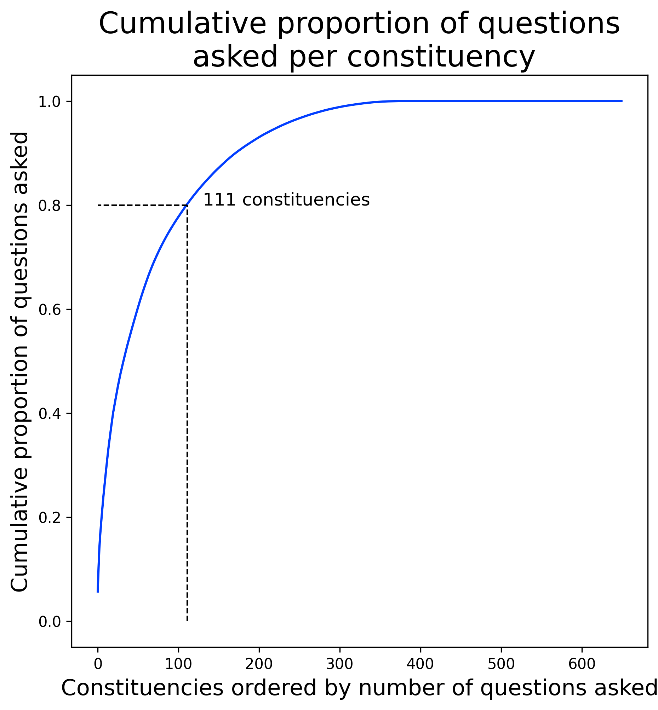
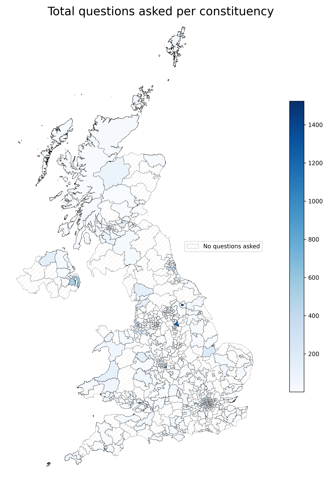
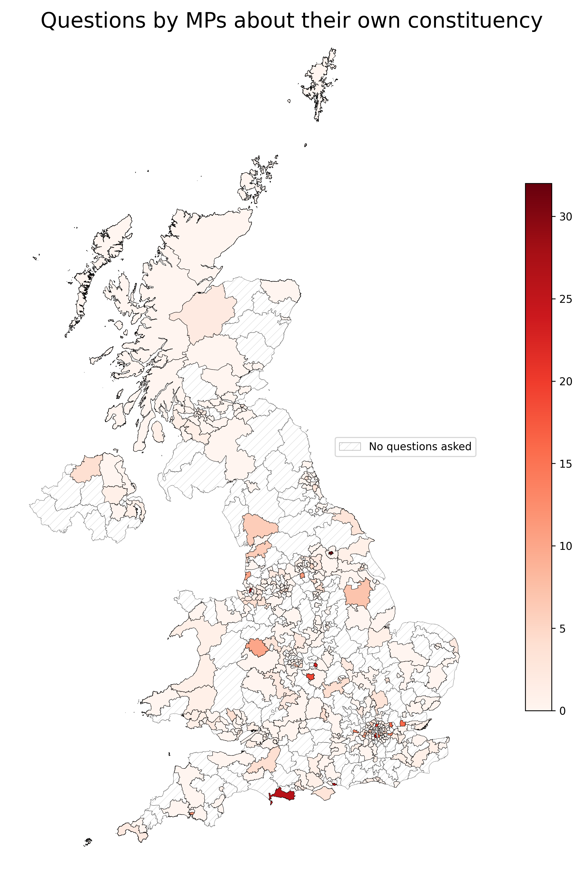
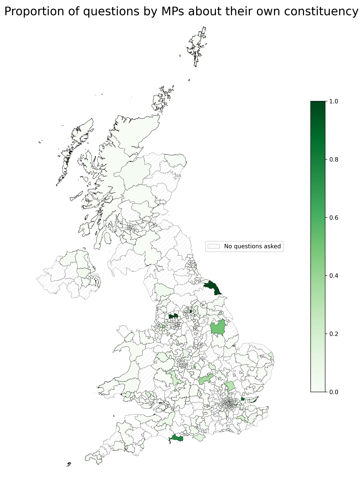
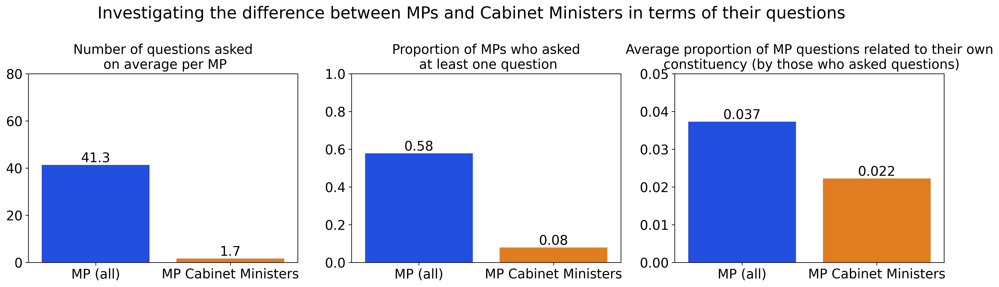
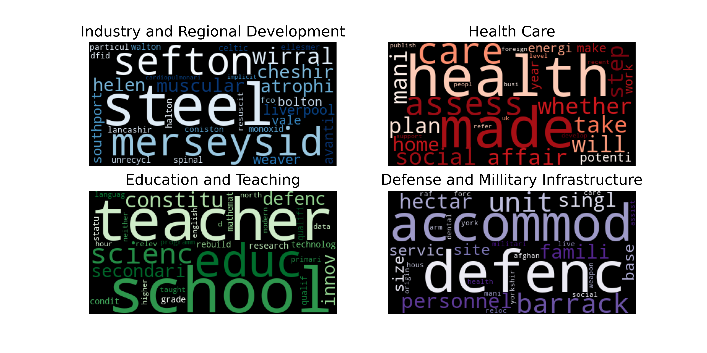
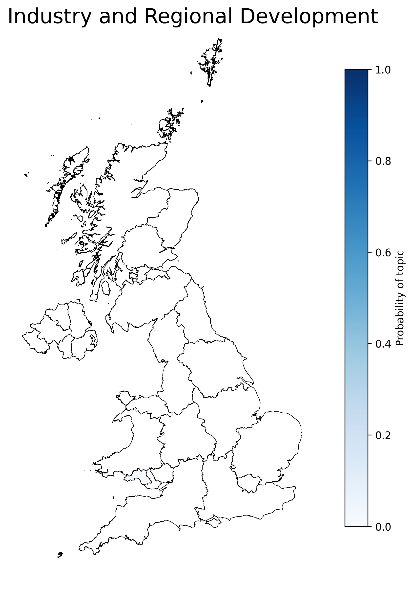
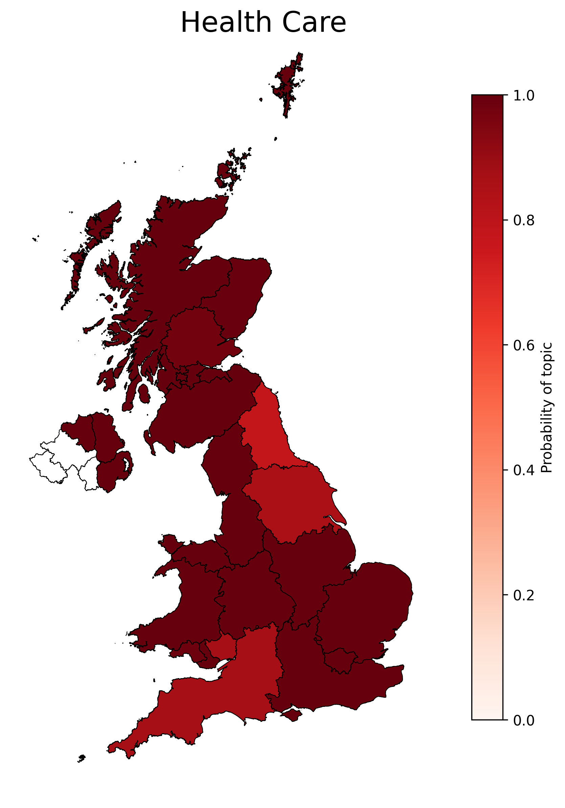
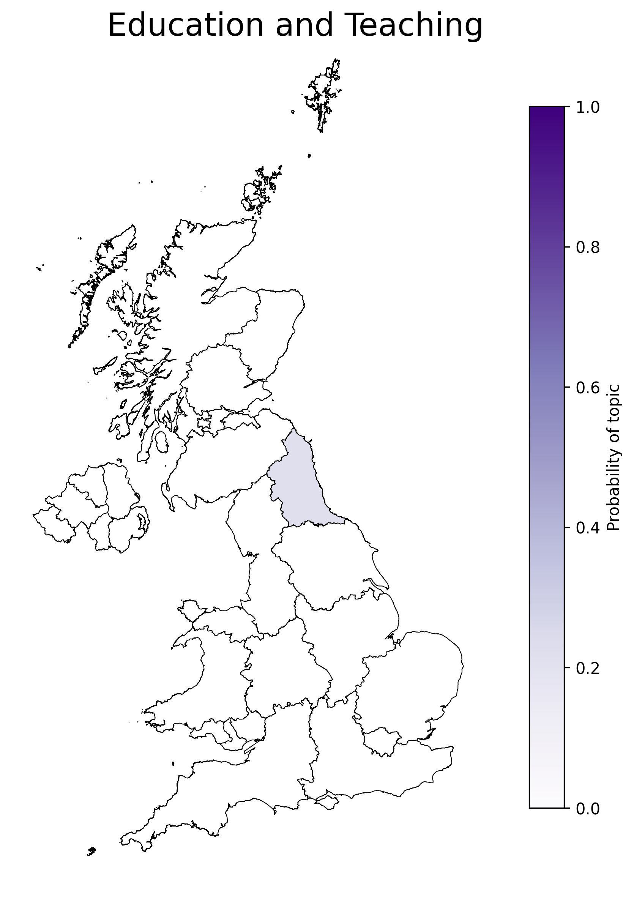
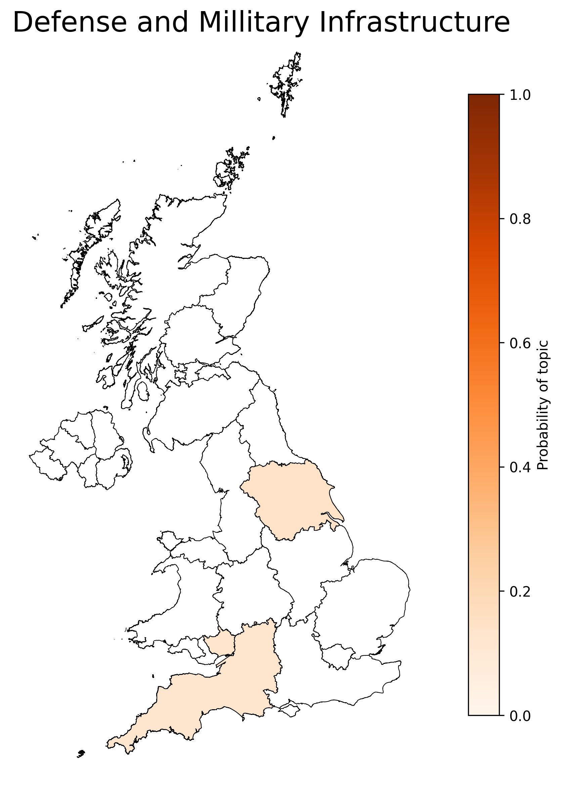

# Computational Modelling in the Humanties and Social Sciences (CMHSS)

## Overview
In this coursework I explored regional differences between questions asked by MPs in the UK. I have outlined may main results briefly and detailed how to reproduce them with the code. If you find this interesting, for a more comprehensive description of my method and results can be read in `jbtl68 - assignment.pdf`. My submission for the coursework received 82/100.

### Question 1
> To what extent do Members of Parliament (MPs) tend to ask questions that directly reference  their own constituency or a location in it? 

Suprisingly, I found that, on average, only 3.7% of MP written questions were directly related to their own constituency. Additionally, over 80% of these written questions were submitted by only 20% of the MPs (see below).

  

There did not appear any clear trend in the number of questions, or constituency focussed questions asked from different regions of the UK

  
  

Cabinet ministers were significantly less likely to ask questions, than regular MPs. Additionally, the questions they did ask were less directed towards their own constituency.

  

#### Instructions to run
Notebooks: 
- "1. extract_entities"
- "2. link_MPs_to_geometry"
- "3. link_entities_to_const"
- "4. const_visualisations"

Data Given:
- shape data for northern ireland 2008 constituencies
- shape data for the rest of the UK (westminster constituency region)
- csv with extracted entities in "question_entities" folder.

How to run: 

- Please note, that there are a lot of python libraries in the requirements.txt, so I would suggest you pip install as you go instead of trying to install all of them.

- Please run each notebook in numerical order. The code is split up to be more understandable on what I am doing at each stage. 

### Question 2
> By applying LDA topic modeling and analyzing the results, what (if any) identifiable regional differences are there in the types of questions asked 

Latent Dirichlet Allocation (LDA) is a method used in natural language processing to obtain the relevant topics within a document. A topic can be thought of as a probability distribution over all words which relate to it. For example, the topic of "Health" might contain a vocubulary of words such as "Hospital", "Medicine", "Ambulance", each with an assigned probability, that sums to 1.  

For the MP written questions, I decided set the number of topics to 4, and the algorithm extracted the following topics:
- Industry and Regional Development
- Health Care
- Education and Teaching
- Defense and Millitary Infrastructure

The word cloud below shows the most prominent words within each topic. For education and defence, the questions asked were primarily from the shadow cabinet minister of the corresponding role.

  

For these topics, regional difference were apparent when viewing their topic probability.

  
    
	  
	    

#### Instructions to run
Notebook: "LDA-Notebook"

Data Given:
- shape data for northern ireland regions, 
- questions.csv, 
- hyper_params.csv
- OS shapefiles for UK regions
		

How to run: Should be able to run the notebook as is
	
 
If you have any issues, please let me know.